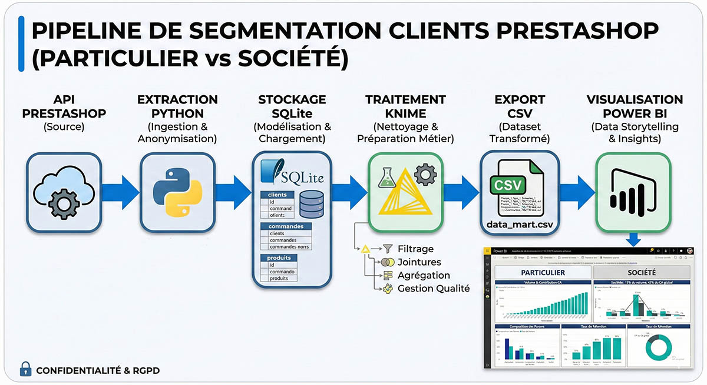
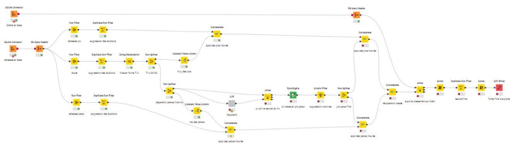

# Pipeline de Segmentation Clients Prestashop



Projet data de bout en bout démontrant l’extraction, la structuration, le nettoyage et l’analyse du comportement client Prestashop pour deux segments : `particulier` vs `société`.

---


## Pourquoi ce projet

Ce repository est un projet destiné à valoriser des compétences en Data Engineering et Data Analysis, issu d'un projet réel mis en place :

- Ingestion de données via l’API Prestashop  
- Modélisation et chargement des données dans SQLite  
- Nettoyage et préparation métier dans KNIME 
 
- Data storytelling avec Power BI et Powerpoint
- Documentation, reproductibilité et bonnes pratiques de gouvernance des données  

Note: Dans ce projet, seul le powerpoint est présenté au client final.

---

## Objectif métier

Construire un pipeline complet permettant d’analyser la distribution et le comportement d’achat entre clients particuliers et entreprises pour en tirer des recommandations actionnables.

Principaux résultats attendus :

- Volume par segment et contribution au chiffre d’affaires  
- Composition des paniers et comportements récurrents par segment  
- Recommandations actionnables pour l’acquisition et la fidélisation  

---

## Stack technique

- **Source** : API Webservice Prestashop  
- **Stockage** : SQLite  
- **Transformation** : Workflow KNIME  
- **Export** : CSV  
- **Visualisation** : Power BI (`dashboard/powerbi/reporting.pbix`)  
- **Rapport final** : `Présentation des résultats.pptx`  

---

## Architecture

Voir `docs/architecture/pipeline.md` pour le flux complet et le diagramme Mermaid.

```text
API Prestashop -> Extraction Python -> SQLite -> Nettoyage KNIME -> CSV (data mart) -> Power BI -> PDF d’insights
```

---

## Structure du repository

```text
.
|-- src/prestashop_etl/             # Modules réutilisables d’extraction + chargement
|-- scripts/                        # Script CLI (exécution pipeline)
|-- config/.env.example             # Modèle de variables d’environnement à copier
README.MD                           # Ce fichier
bdd.db                              # Base Mysql destinée à recevoir les données de prestashop
exemple_clean_data.csv              # Fichier exemple données en sortie de knime
Présentation des résultats.pptx     # Powerpoint de présentation (données non réelles)
reporting.pbix                      # Reporting PowerBI analysant le CSV issu de knime
Workflow_knime.knwf                 # Workflow Knime pour trier et configurer les données


```

---

## Démarrage rapide

1. Créer et activer un environnement virtuel.  
2. Installer les dépendances :

```bash
pip install -r requirements.txt
```

3. Créer un fichier `.env` à partir du modèle :

```bash
copy config/.env.example .env
```

4. Renseigner vos identifiants Prestashop dans `.env`.  
5. Lancer l’extraction et le chargement :

```bash
python scripts/run_pipeline.py
```

6. Ouvrir le workflow KNIME et configurer le chemin de la bdd dans les deux noeuds de connection à la base Mysql. Idem changer le chemin de sortie du fichier final (dernière étape)
note: 
Il y a un MegaNode LLM facultatif qui permet de demander à un modele externe de faire un dernier tri dans le cas où les pro n'aient pas renseignés leur numero TVA ou pas suivi les bonnes pratiques (idem si un particulier a mis son nom dans le numero de tva): si besoin, il faut rentrer dans le Node et configurer la clé API et le modele a utiliser.

7. exécuter les transformations dans Knime

8. ouvrir `dashboard/powerbi/reporting.pbix`, changer la source de données (on peux utiliser le fichier `exemple_clean_data.csv`, sinon pointer sur le CSV) puis rafraichir les données  

---

## Confidentialité et anonymisation des données

Ce projet manipule des données clients réelles. Pour des raisons évidentes de confidentialité et de conformité RGPD, le repository est conçu pour être partagé publiquement sans exposer de données personnelles :

- Les données brutes sont exclues.

- Les clés API sont chargées via des variables d’environnement, et ne sont jamais codées en dur.

- Les données exemples ont été modifiées et anonymisées et ne refletent donc aucune donnée réelle.

---

## Compétences démontrées

- Orchestration ETL (API → base → datasets transformés)  
- Logique d’extraction incrémentale et appels batch API  
- Modélisation relationnelle sous SQLite  
- Gestion de la qualité des données dans KNIME  
- Création de dashboards BI et communication d’insights  
- Documentation professionnelle et gouvernance de projet Data

---

## Avertissement

Ce repository est destiné à une démonstration technique.  
Toute utilisation en production doit respecter la conformité légale (RGPD), le principe du moindre privilège et une gestion sécurisée des secrets.  
